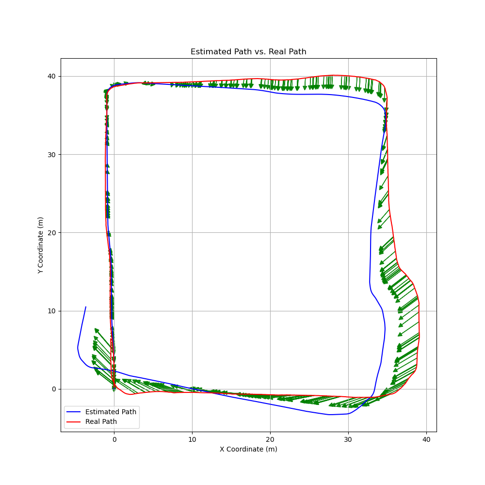
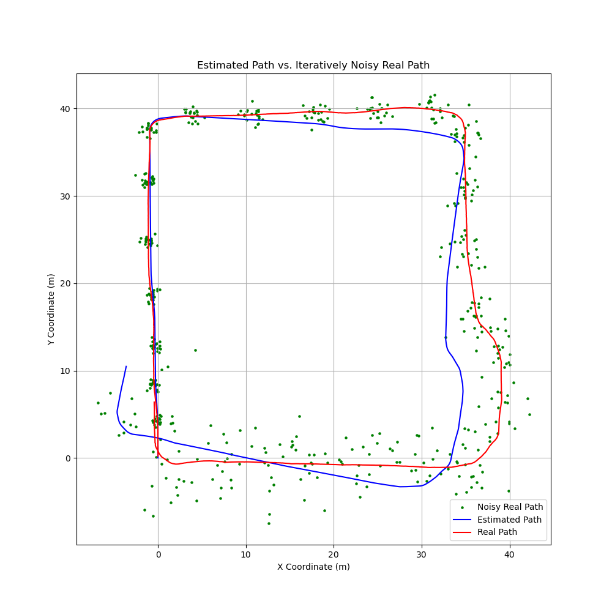

# 作业一报告

<center><div style='height:2mm;'></div><div style="font-size:10pt;">EmptyBlue</div></center>
<center><span style="font-size:9pt;line-height:9mm"><i>Peking University</i></span>
</center>


## 实验概述
### 实验目的
   - 利用内部传感器数据，计算小车行驶轨迹
   - 分析内部传感器运动估计的误差原因
   - 可视化小车运动估计的误差分布与传播

### 实验工具
#### 实验数据
   - **传感器数据**
     - 惯性导航数据文件: `InterSense_X_20130903_195003.txt`
     - 编码器数据文件: `COMPort_X_20130903_195003.txt`
   - **参考数据**
     - SLAM地图数据: 
       - 主数据文件: `ld.master`
       - 原始数据文件: `ld.raw`
     - SLAM轨迹数据: `ld.nav`

#### 软件工具
   - **可视化软件**
     - 工具: `mapshow.exe` - 用于展示SLAM结果的地图和轨迹的可视化工具
   - **开发工具**
     - 平台: **RobotSDK** - 一个基于Qt的跨平台机器人应用程序开发工具包
     - 运行环境: 通过在**Virtualbox**虚拟机上运行RobotSDK进行开发和实验


## 轨迹计算

### 惯性导航系统数据

文件名: `InterSense_DataFile.txt`

数据格式: `IMU [时间戳] [帧率] [数据有效性] [横滚角] [俯仰角] [朝向角度]`

- 时间戳: LONG型数据，单位为毫秒。
- 帧率和数据有效性: 代表数据的频率及其是否有效。数据值大于等于180时认为是有效的。
- 横滚角和俯仰角: 描述设备的空间方向。
- 朝向角度: 范围从-180°到 180°，描述设备的朝向。

### 编码器数据

文件名: `Encoder_DataFile.txt`

数据格式: `E [时间戳] [标志位] [脉冲数]`

- 时间戳: LONG型数据，单位为毫秒。
- 脉冲数: 表示行驶的距离。每个脉冲代表一定的距离单位（例如：0.0038 米）。需要注意的是，当脉冲数达到一定值如30000时，数据会溢出并从0开始。

### 轨迹计算：航位推算法

#### 轨迹计算原理

$\theta_t,\theta_{t+1}$ ：两时刻的小车方向，由惯性导航数据给出

$dis_t$ ：单位时间下小车行进距离，由编码器数据给出

那么小车在两时刻 $t$ , $t+1$ 间的坐标有如下关系：
$$
x_{t+1}=x_t+dis_t\times \cos(\frac{\theta_t+\theta_{t+1}}{2})
$$

$$
y_{t+1}=y_t+dis_t\times \sin(\frac{\theta_t+\theta_{t+1}}{2})
$$


其中将小车在两时刻间的行进方向近似为两时刻小车朝向的中间方向

将小车放置在原点处即可递推计算出小车路线

#### 轨迹计算代码

### 轨迹可视化


## 误差分析
### SLAM地图与估计地图的可视化

其中绿色箭头方向代表计算点偏离真实点（误差）的方向，绿色箭头长度代表误差的大小。



### 误差分析

#### 数据分析

1. 对比内部传感器计算的轨迹与SLAM的结果，可以发现传感器计算的路径逐渐偏离真实路径，并且偏离越来越大。
2. 分析误差大小，可以看出小车走直线的时候误差较小，小车拐弯的时候误差较大
3. 分析误差方向，可以看出误差往往偏向真实路径右侧

#### 原因分析

1. 内部传感器计算的轨迹与SLAM的差异

   这种逐渐偏离的现象与误差积累直接相关。一旦一个小误差在初期被引入系统，如果没有及时纠正，随着时间的推移，这个误差将累积并对最终的轨迹产生更大的影响。

   这也可能与简化的运动模型有关，因为一个过于简化的模型可能无法准确地描述机器人在实际环境中的运动。

2. 直线与拐弯时误差的差异

   小车走直线时误差较小：直线运动通常较容易模拟和预测，因此即使模型相对简化，也能取得相对准确的结果。

   小车拐弯时误差较大：在转弯时，尤其是非线性运动下，可能未被准确地描述。同时，转弯运动往往要求传感器能准确感知细微的变化，但是真实的轮子滚动往往不是纯滚动，拐弯时滑动摩擦较多，这可能是较重要的原因。

3. 误差方向的一致性

   这一现象可能与系统性的误差有关，可能源于传感器误差或数据采集帧率不足。如果传感器的测量结果或帧率系统性地偏向一侧，这将导致轨迹估计也呈现出相同的系统性偏差。

   例如，如果右侧的轮速传感器系统性地高估速度，那么在转弯和直线行驶时都可能导致轨迹偏向右侧。

#### 总结与建议：

1. 调整模型：考虑在算法层面采用更复杂的运动模型，能更精确地描述和预测机器人的运动。
   优化传感器：校准或更换更精确的传感器，以减少传感器误差对轨迹估计的影响。
   提高数据采集帧率：提高帧率可以帮助系统更精确地捕捉到机器人的运动变化，减少因数据采样不足导致的轨迹估计误差和数据对齐时的数据丢失。
2. 实施误差纠正机制：考虑实施基于滤波或其他机制的误差纠正策略，以便在线矫正积累误差。
   分析系统性偏差：进一步研究和识别潜在的系统性偏差源，在实验之前进行必要的校准或调整以消除或减小这些偏差。


## 误差传播的可视化
### 误差分布的可视化

使用正态分布模拟可能产生的误差大小。



### 误差传播分析

可以看出距离上一个校准点（起始点）越远，噪音路径越分散，越难以确定准确位置。


## 代码附录

### 小车轨迹计算代码填空

```c++
//Input Port #0: Buffer_Size = 10, Params_Type = Simulator_Sensor_Encoder_Params, Data_Type = Simulator_Sensor_Encoder_Data
//Input Port #1: Buffer_Size = 10, Params_Type = Simulator_Sensor_IMU_Params, Data_Type = Simulator_Sensor_IMU_Data
bool DECOFUNC(processMultiInputData)(void * paramsPtr, void * varsPtr, QVector<QVector<void *> > inputParams, QVector<QVector<void *> > inputData, void * outputData, QList<int> & outputPortIndex)
{
	ProcessorMulti_Algorithm_Deadreckoning_Params * params=(ProcessorMulti_Algorithm_Deadreckoning_Params *)paramsPtr;
	ProcessorMulti_Algorithm_Deadreckoning_Vars * vars=(ProcessorMulti_Algorithm_Deadreckoning_Vars *)varsPtr;
	QVector<Simulator_Sensor_Encoder_Params *> inputparams_0; copyQVector(inputparams_0,inputParams[0]);
	QVector<Simulator_Sensor_IMU_Params *> inputparams_1; copyQVector(inputparams_1,inputParams[1]);
	QVector<Simulator_Sensor_Encoder_Data *> inputdata_0; copyQVector(inputdata_0,inputData[0]);
	QVector<Simulator_Sensor_IMU_Data *> inputdata_1; copyQVector(inputdata_1,inputData[1]);
	ProcessorMulti_Algorithm_Deadreckoning_Data * outputdata=(ProcessorMulti_Algorithm_Deadreckoning_Data *)outputData;
	outputPortIndex=QList<int>();
	if(inputdata_0.size()==0){return 0;}
	if(inputdata_1.size()==0){return 0;}
	/*======Please Program below======*/
    // 读入编码器数据和IMU的航向角,并转为弧度制
    int pluseNum        = inputdata_0.front()->pulse;         // 编码器最近帧脉冲数据，增加即小车向前走
    int pluseMax        = inputparams_0.front()->pulseMax;    // 编码器脉冲数最大数据
    double disPerPluse  = inputparams_0.front()->disPerPulse; // 编码器单脉冲对应的距离 单位为m
    int angle           = inputdata_1.front()->yaw;           // IMU最近帧航向角数据，单位为度，顺时针为正方向
    int timeStamp       = inputdata_0.front()->timestamp;     // 传感器传回最近帧的时间戳,已同步
    double currentOri   = angle * vars->PI / 180.0;           // 转为弧度制

    // 判断是否为第一帧数据，初始化
    if (!vars->isInit) {
        vars->isInit = true;
        vars->initOriValue = currentOri;
        vars->lastpulsenum = pluseNum;
    }
  
    // 计算小车当前时刻的角度，减去初始偏置
    currentOri += vars->initori - vars->initOriValue;

    // 计算小车行驶的距离,注意处理编码器数据溢出
    int deltaPluse = pluseNum - vars->lastpulsenum;

/***********************************填写以下部分**********************************/

    // --------------------处理编码器数据溢出,并将单位转换为m-------------------------
    deltaPluse=(deltaPluse + pluseMax) % pluseMax;
    double distance = deltaPluse * disPerPluse;
    // --------------------处理编码器数据溢出,并将单位转换为m-------------------------

    // --------------------计算小车当前时刻的位置，并更新last数据--------------------
    double averageOri  =(vars->lastori + currentOri)/2;
    vars->lastx        = vars->lastx + distance * cos(averageOri);
    vars->lasty        = vars->lasty + distance * sin(averageOri);
    vars->lastori      = currentOri;
    vars->lastpulsenum = pluseNum;
    // --------------------计算小车当前时刻的位置，并更新last数据--------------------
  
    // ----------------------填充outputdata--------------------------------------
    outputdata->orientation = vars->lastori;
    outputdata->timestamp   = timeStamp;
	 // 可视化坐标系和全局坐标系x轴相反，赋值时需要取相反数
    outputdata->x           = -vars->lastx;
    outputdata->y           = vars->lasty;
    // ----------------------填充outputdata--------------------------------------
  
/**********************************填写以上部分***********************************/
  	return 1;
}
```

### 估计地图与真实地图的可视化

```python
import math
import matplotlib.pyplot as plt
import numpy as np

def read_inertial_navigation(file_name):
    with open(file_name, 'r') as f:
        lines = f.readlines()
        data = [line.split() for line in lines if int(line.split()[1]) >= 71440000 and int(line.split()[1]) <= 71550000]
    return data  # ['IMU', timestamp, frame_rate, data_validity, roll, pitch, orientation]


def read_encoder(file_name):
    with open(file_name, 'r') as f:
        lines = f.readlines()
        data = [line.split() for line in lines if int(line.split()[1]) >= 71440000]
    return data  # ['E', timestamp, _, pulse_count]


def calculate_estimated_path(inertial_data, encoder_data):
    estimated_path = []
    x, y = 0, 0  # Initial position
    pulse_idx_previous = 0  # Initial pulse index
    theta_offset=float(inertial_data[0][-1])-90
    theta_previous = float(inertial_data[0][-1])  # Initial orientation

    # Iterating through the data and calculating the path
    for i in range(1, len(inertial_data)):
        # Get the orientation and distance traveled
        theta_current = float(inertial_data[i][-1])
        
        # Find the pulse index for the current timestamp
        pulse_idx_now=pulse_idx_previous
        for j in range(pulse_idx_previous, len(encoder_data)):
            if(int(encoder_data[j][1])>=int(inertial_data[i][1])):
                pulse_idx_now=j
                break
        delta_pulse = (int(encoder_data[pulse_idx_now][-1]) - int(encoder_data[pulse_idx_previous][-1])+30000)%30000
        dis_t = delta_pulse * 0.003846154  # Convert pulse to distance

        # Calculate new position based on provided equations
        x = x - dis_t * math.cos(math.radians((theta_previous + theta_current) / 2 - theta_offset))
        y = y + dis_t * math.sin(math.radians((theta_previous + theta_current) / 2 - theta_offset))
        
        # Update the path and previous orientation
        estimated_path.append((int(inertial_data[i][1]), x, y, theta_current))
        
        pulse_idx_previous = pulse_idx_now
        theta_previous = theta_current
    
    return estimated_path


def read_slam_result(file_name):
    with open(file_name, 'r') as f:
        lines = f.readlines()
        data = [line.split() for line in lines if line[0] !='t' and int(line.split()[0]) >= 71440000 and int(line.split()[0]) <= 71550000]
    return data  # [time, ang.x, ang.y, ang.z, shv.x, shv.y, shv.z]


def calculate_real_path(slam_data):
    real_path = []
    for datum in slam_data:
        time = int(datum[0])
        x = float(datum[4])
        y = float(datum[5])
        z = float(datum[6])
        real_path.append((time, x, y, z))
    return real_path


def plot_paths(estimated_path, real_path, arrow_frequency=3, arrow_scale=0.5):
    # Split the path into X and Y coordinates for plotting
    est_timestamp, est_x, est_y, est_orientations = zip(*[(d[0], d[1], d[2], d[3]) for d in estimated_path])
    real_timestamp, real_x, real_y, real_z = zip(*[(d[0], d[1], d[2], d[3]) for d in real_path])

    plt.figure(figsize=(10, 10))
    plt.plot(est_x, est_y, label='Estimated Path', color='b')
    plt.plot(real_x, real_y, label='Real Path', color='r')
    
    # Align timestamps between estimated and real path
    est_idx = 0
    real_idx = 0

    while est_idx < len(est_timestamp) and real_idx < len(real_timestamp):
        est_time = est_timestamp[est_idx]
        real_time = real_timestamp[real_idx]
        
        if abs(est_time - real_time) < 5:  # Assuming timestamps are in milliseconds, adjust as per requirement
            # Only draw an arrow for every [arrow_frequency] aligned points
            if est_idx % arrow_frequency == 0:
                # Draw an arrow from real position to estimated position, with reduced length
                dx = (est_x[est_idx] - real_x[real_idx]) * arrow_scale
                dy = (est_y[est_idx] - real_y[real_idx]) * arrow_scale
                plt.arrow(real_x[real_idx], real_y[real_idx], dx, dy, color='g', alpha=0.9, width=0.01, head_width=0.5, head_length=0.5, shape='full')
            est_idx += 1
            real_idx += 1
        elif est_time < real_time:
            est_idx += 1
        else:
            real_idx += 1
    
    plt.title('Estimated Path vs. Real Path')
    plt.xlabel('X Coordinate (m)')
    plt.ylabel('Y Coordinate (m)')
    plt.legend()
    plt.grid(True)
    plt.show()


inertial_data = read_inertial_navigation('InterSense_X_20130903_195003.txt')
encoder_data = read_encoder('COMPort_X_20130903_195003.txt')
estimated_path = calculate_estimated_path(inertial_data, encoder_data)

slam_data = read_slam_result('ld.nav')
real_path = calculate_real_path(slam_data)

plot_paths(estimated_path, real_path)

print("Done")
```


### 误差传播的可视化代码

```python
import math
import matplotlib.pyplot as plt
import numpy as np

def read_inertial_navigation(file_name):
    with open(file_name, 'r') as f:
        lines = f.readlines()
        data = [line.split() for line in lines if int(line.split()[1]) >= 71440000 and int(line.split()[1]) <= 71550000]
    return data  # ['IMU', timestamp, frame_rate, data_validity, roll, pitch, orientation]


def read_encoder(file_name):
    with open(file_name, 'r') as f:
        lines = f.readlines()
        data = [line.split() for line in lines if int(line.split()[1]) >= 71440000]
    return data  # ['E', timestamp, _, pulse_count]


def calculate_estimated_path(inertial_data, encoder_data):
    estimated_path = []
    x, y = 0, 0  # Initial position
    pulse_idx_previous = 0  # Initial pulse index
    theta_offset=float(inertial_data[0][-1])-90
    theta_previous = float(inertial_data[0][-1])  # Initial orientation

    # Iterating through the data and calculating the path
    for i in range(1, len(inertial_data)):
        # Get the orientation and distance traveled
        theta_current = float(inertial_data[i][-1])
        
        # Find the pulse index for the current timestamp
        pulse_idx_now=pulse_idx_previous
        for j in range(pulse_idx_previous, len(encoder_data)):
            if(int(encoder_data[j][1])>=int(inertial_data[i][1])):
                pulse_idx_now=j
                break
        delta_pulse = (int(encoder_data[pulse_idx_now][-1]) - int(encoder_data[pulse_idx_previous][-1])+30000)%30000
        dis_t = delta_pulse * 0.003846154  # Convert pulse to distance

        # Calculate new position based on provided equations
        x = x - dis_t * math.cos(math.radians((theta_previous + theta_current) / 2 - theta_offset))
        y = y + dis_t * math.sin(math.radians((theta_previous + theta_current) / 2 - theta_offset))
        
        # Update the path and previous orientation
        estimated_path.append((int(inertial_data[i][1]), x, y, theta_current))
        
        pulse_idx_previous = pulse_idx_now
        theta_previous = theta_current
    
    return estimated_path


def read_slam_result(file_name):
    with open(file_name, 'r') as f:
        lines = f.readlines()
        data = [line.split() for line in lines if line[0] !='t' and int(line.split()[0]) >= 71440000 and int(line.split()[0]) <= 71550000]
    return data  # [time, ang.x, ang.y, ang.z, shv.x, shv.y, shv.z]


def calculate_real_path(slam_data):
    real_path = []
    for datum in slam_data:
        time = int(datum[0])
        x = float(datum[4])
        y = float(datum[5])
        z = float(datum[6])
        real_path.append((time, x, y, z))
    return real_path

def add_iterative_noise_to_path(path, interval, noise_magnitude, N):
    """Add iterative noise to the path."""
    noisy_points = []
    
    for i, (timestamp, x, y, z) in enumerate(path):
        if (i+1) % interval == 0:
            for _ in range(N):
                noise_x = np.random.normal(0, noise_magnitude)
                noise_y = np.random.normal(0, noise_magnitude)

                noisy_x = x + noise_x
                noisy_y = y + noise_y

                noisy_points.append((timestamp, noisy_x, noisy_y, z))

                # Increase the noise magnitude for next iteration
                noise_magnitude *= 1.005  # 5% increase in noise magnitude
                N=int(N*1.005)

    return noisy_points


def plot_paths(estimated_path, real_path, interval, noise_magnitude, N):
    # Add iterative noise to the real path
    noisy_real_path = add_iterative_noise_to_path(real_path, interval, noise_magnitude, N)
    
    # Split the path into X and Y coordinates for plotting
    noisy_real_timestamp, noisy_real_x, noisy_real_y, noisy_real_z = zip(*[(d[0], d[1], d[2], d[3]) for d in noisy_real_path])
    est_timestamp, est_x, est_y, est_orientations = zip(*[(d[0], d[1], d[2], d[3]) for d in estimated_path])
    real_timestamp, real_x, real_y, real_z = zip(*[(d[0], d[1], d[2], d[3]) for d in real_path])

    
    plt.figure(figsize=(10, 10))
    plt.scatter(noisy_real_x, noisy_real_y, c='g', s=5, label='Noisy Real Path')    
    plt.plot(est_x, est_y, label='Estimated Path', color='b')
    plt.plot(real_x, real_y, label='Real Path', color='r')

    
    plt.title('Estimated Path vs. Iteratively Noisy Real Path')
    plt.xlabel('X Coordinate (m)')
    plt.ylabel('Y Coordinate (m)')
    plt.legend()
    plt.grid(True)
    plt.show()


inertial_data = read_inertial_navigation('InterSense_X_20130903_195003.txt')
encoder_data = read_encoder('COMPort_X_20130903_195003.txt')
estimated_path = calculate_estimated_path(inertial_data, encoder_data)

slam_data = read_slam_result('ld.nav')
real_path = calculate_real_path(slam_data)

plot_paths(estimated_path, real_path, 70, 0.3, 20)

print("Done")
```

