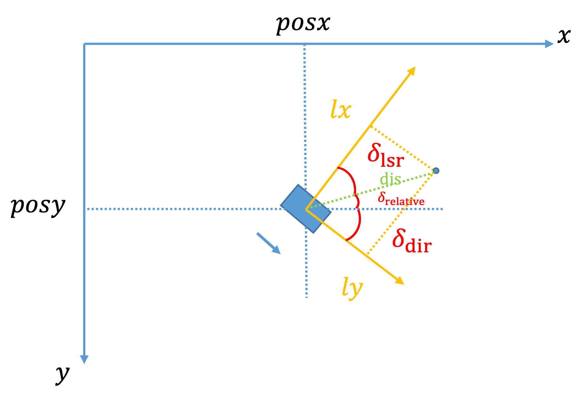

# 作业二报告

<center><div style='height:2mm;'></div><div style="font-size:10pt;">EmptyBlue</div></center>
<center><span style="font-size:9pt;line-height:9mm"><i>Peking University</i></span>
</center>


## 实验目的

通过利用激光及定位数据，实现栅格地图的计算。


## 实验原理

采用简易投票法来创建栅格地图。栅格地图上的每一点的颜色深浅代表了该区域内激光点的数量，颜色越红表示障碍物的可能性越高。

### 激光点坐标计算原理



$(x_t,y_t)$ ：小车位置，来源于作业一结果

$\delta_{dir}$ ：小车方向，来源于作业一结果

$\delta_{lsr}$ ：根据激光序号等分180度得出

$dis_t$ ：激光点距离小车距离，来源于激光激光扫描数据

$\delta_{relative}=\frac{\pi}2-\delta_{lsr}-\delta_{dir}$

那么激光点的全局坐标满足：
$$
x_{lsr,t}=x_t+dis_t\times \cos(\delta_{relative})
$$

$$
y_{lsr,t}=y_t-dis_t\times \sin(\delta_{relative})
$$


### 简易投票法原理

设置全局地图为空白，每计算出一个激光点，在得出的激光点的全局坐标对应的像素点（除以单位像素点对应的真实距离）计数加一，最后可视化。

### 数据来源

激光扫描数据来源于 `URG_X_20130903_195003.lms` 文件。


## 代码实现

`DECOFUNC` 函数

```c++

bool DECOFUNC(processMultiInputData)(void * paramsPtr, void * varsPtr, QVector<QVector<void *> > inputParams, QVector<QVector<void *> > inputData, void * outputData, QList<int> & outputPortIndex)
{
	ProcessorMulti_Algorithm_Mapping_Params * params=(ProcessorMulti_Algorithm_Mapping_Params *)paramsPtr;
	ProcessorMulti_Algorithm_Mapping_Vars * vars=(ProcessorMulti_Algorithm_Mapping_Vars *)varsPtr;
	QVector<ProcessorMulti_Algorithm_Deadreckoning_Params *> inputparams_0; copyQVector(inputparams_0,inputParams[0]);
	QVector<Simulator_Sensor_Lidar_URG_Params *> inputparams_1; copyQVector(inputparams_1,inputParams[1]);
	QVector<ProcessorMulti_Algorithm_Deadreckoning_Data *> inputdata_0; copyQVector(inputdata_0,inputData[0]);
	QVector<Simulator_Sensor_Lidar_URG_Data *> inputdata_1; copyQVector(inputdata_1,inputData[1]);
	ProcessorMulti_Algorithm_Mapping_Data * outputdata=(ProcessorMulti_Algorithm_Mapping_Data *)outputData;
	outputPortIndex=QList<int>();
	if(inputdata_0.size()==0){return 0;}
	if(inputdata_1.size()==0){return 0;}
   
    // ========================== 请完成以下程序段! ==========================

    // 遍历所有激光点，计算它们在全局坐标系中的位置
    for (int i = 0; i < inputdata_1.front()->datasize ; i++) {

       // 计算得到单个激光点的距离(m)和角度(rad)
       double pi=3.1415926535897934384626;
       double dis=inputdata_1.front()->data[i]/10;//0.1m
       double angle=i/2; //in degree
       double angle_rad=pi*angle/180; // in rad

       // 激光点在全局坐标系中的位置 单位m
       double angle_relative=pi/2-angle_rad-inputdata_0.front()->orientation;
       double gx=inputdata_0.front()->x*10+dis*cos(pi-angle_relative);//设传感器激光坐标系中激光束与原本x轴的夹角为angle，则计算时应当取angle = 180 - angle
       double gy=inputdata_0.front()->y*10-dis*sin(angle_relative);
       printf(" x, y: (%lf, %lf) ",inputdata_0.front()->x,inputdata_0.front()->y);
       printf(" dis, angle: (%lf, %lf) ",dis,angle_relative);


       // 激光点在栅格地图中的位置 单位 pixel
       int mapx = gx+100;
       int mapy = gy+500;
       printf(" w, h: (%d, %d) ",params->mapWidth,params->mapHeight);
       printf(" pixel: (%d, %d) \n",mapx,mapy);

       // 更新地图
       if(mapx >= 0 && mapx < params->mapWidth && mapy >= 0 && mapy < params->mapHeight)
       {
           if(vars->map[mapy][mapx]+1<=255)
           {
                vars->map[mapy][mapx]+=1;
           }
           else
           {
               vars->map[mapy][mapx]=255;
           }
       }
    }

    outputdata->width=params->mapWidth;
    outputdata->height=params->mapHeight;

    // ========================== 请完成以上程序段! ==========================

    //output 拷贝给输出
    for(int i = 0 ; i < params->mapHeight ; i ++) {
        memcpy(outputdata->map[i], vars->map[i], sizeof(char) * params->mapWidth);
    }

    outputdata->timestamp_deadreconing=inputdata_0.front()->timestamp;
    outputdata->timestamp_laser=inputdata_1.front()->timestamp;
    outputdata->mapX=inputdata_0.front()->x;
    outputdata->mapY=inputdata_0.front()->y;

    return 1;
}
```


`LP2GP` 函数

```c++
void LP2GP(double lx, double ly, double posx, double posy, double ori, double * gx, double * gy) {
    ori = 3.14159265359 - ori;  //将航向角转换为激光坐标系下的角度
    double dis=sqrt(lx*lx+ly*ly);
    double pi=3.141592653589793626;
    double theta=atan(lx/ly)-ori;
    *gx = posx+dis*cos(theta);
    *gy = posy-dis*sin(theta);
}
```


## 地图可视化


