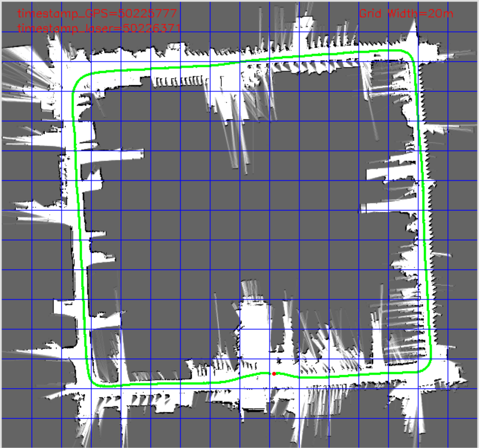
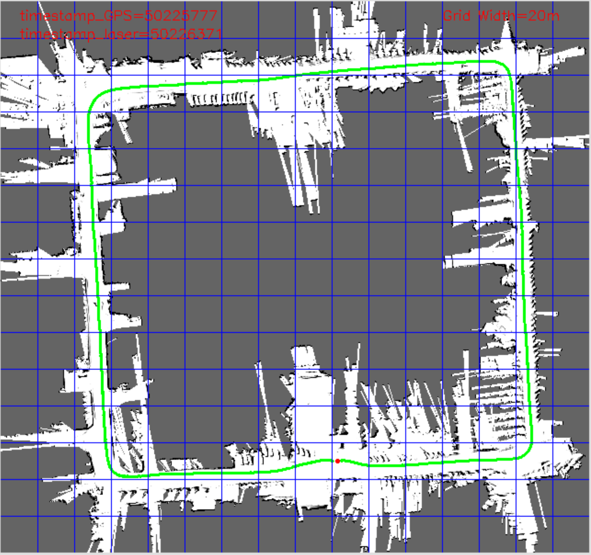

# 作业三报告

<center><div style='height:2mm;'></div><div style="font-size:10pt;">EmptyBlue</div></center>
<center><span style="font-size:9pt;line-height:9mm"><i>Peking University</i></span>
<center><div style='height:2mm;'></div><div style="font-size:10pt;">2023年12月13日</div></center>
</center>


## 作业要求

使用小车行驶轨迹以及激光数据计算占有栅格地图 (OGM)


## 作业数据

1. 激光扫描数据 a20160801135224.lms1
2. 车辆行驶轨迹 a-XW-20160801135224.nav


## 计算过程

首先计算各激光点在激光雷达坐标系下的坐标，然后将激光雷达坐标系下的坐标变换到机器人坐标系下，然后再变换到全局坐标系下，对小车到激光束尽头这段激光经过的像素点进行更新，计算得出占有栅格地图。

需要注意的是可能会出现上述两个文件的激光数据和轨迹数据同步错误的情况。

如图所示，激光数据比对应时刻的路径数据提前出现，导致路线上的许多特征在正确的地方之前出现，并且因此在转弯的时候非常模糊。


解决方法是在 `example_app2/Sources/mainwindow.cpp` 中找到 `speed` 变量，将其调大（这个变量越大，地图识别速度越慢），就可以将激光数据和轨迹数据同步更好。


## 关键代码

### 占有栅格地图

```c
// 8.根据OGM地图生成方法制图。
// 地图存储在vars->map[][]中，坐标轴为vars->map[y][x]。
// 定义每个栅格vars->map[y][x]取值上下界。
double upthres = 300;
double lowthres = -300;
// 逐个更新当前激光束途经的栅格点坐标，params->logodd_free，params->logodd_occu为检测到当前坐标为无障碍/有障碍的更新值。
for (std::vector<Location>::iterator c = locationVec.begin(); c != locationVec.end(); c++)
{
    if ((*c).x >= 0 && (*c).x < params->mapWidth && (*c).y >= 0 && (*c).y < params->mapHeight)
    {
        if (c + 1 == locationVec.end())
            vars->map[(*c).y][(*c).x] += params->logodd_occu;
        else
            vars->map[(*c).y][(*c).x] += params->logodd_free;
        vars->map[(*c).y][(*c).x] = std::min(vars->map[(*c).y][(*c).x], upthres);
        vars->map[(*c).y][(*c).x] = std::max(vars->map[(*c).y][(*c).x], lowthres);
    }
}
```

### 栅格投票法

```c
// 8.根据 Grid Counting 地图生成方法制图。
// 地图存储在vars->map[][]中，坐标轴为vars->map[y][x]。
// 定义每个栅格vars->map[y][x]取值上下界。
double upthres = 300;
double lowthres = -300;
// 逐个更新当前激光束途经的栅格点坐标，params->logodd_free，params->logodd_occu为检测到当前坐标为无障碍/有障碍的更新值。
// printf("mapWidth=%d, mapHeight=%d\n", params->mapWidth, params->mapHeight); // 640, 600
static int hit[600][640] = {{0}};
static int miss[600][640] = {{0}};
for (std::vector<Location>::iterator c = locationVec.begin(); c != locationVec.end(); c++)
{
    if ((*c).x >= 0 && (*c).x < params->mapWidth && (*c).y >= 0 && (*c).y < params->mapHeight)
    {
        if (c + 1 == locationVec.end())
        {
            hit[(*c).y][(*c).x]++;
        }
        else
        {
            miss[(*c).y][(*c).x]++;
        }
        vars->map[(*c).y][(*c).x] = -300 + 600 * hit[(*c).y][(*c).x] / (hit[(*c).y][(*c).x] + miss[(*c).y][(*c).x]);
    }
}
```


## 可视化效果展示




## 拓展

### 简易投票法

这里采用第二次作业的可视化结果进行对比


### 占有栅格地图


### 栅格投票法



### 三者对比

1. 简易投票法只能给出障碍的大致位置，不知道哪些区域是可以行走的，哪些区域是不可达的；并且由于数据持续时间较短，所以关于岔路口的细节较少，只有大概的楼道样子
2. 占有栅格地图和栅格投票法都可以给出可以行走的楼道区域，并且细节较为丰富，可以高效利用短暂的射向岔路的激光束
   1. 占有栅格地图是通过计算每个格点被占据的概率来给出地图
   2. 栅格投票法是通过估计每个格点的反射概率来给出地图，如果某个格点的 hit 计数较高，就说明它反射率较高，更有可能是一个障碍物。
   3. 栅格投票法直观反映每个障碍物的反射率，可以侧面反映障碍物的材质，比如金属、木材、塑料、玻璃等。
   4. 栅格投票法的劣势：已知反射率需要恰当安排对应的的地图灰度值，否则可能让不同的反射率障碍物看起来具有相同的反射率。
